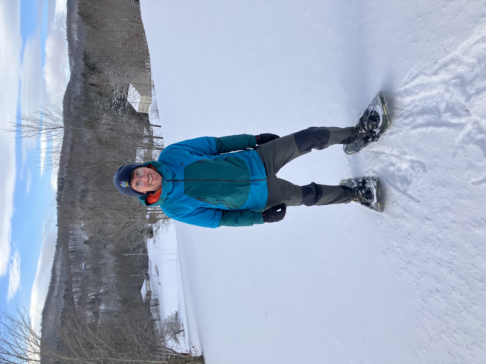

I am a network and freshwater ecologist who is interested in understanding how ecological interactions affect and are affected by environmental changes. Technically, I am the Group lead of the Freshwater Networks Lab, but really it is a massive group effort! 

Although the group is called the "Freshwater" Networks Lab, I have been known to work across terrestrial and aquatic ecosystems, and I am an unashamed generalist. So, if you have a project idea or would like to have a chat about opportunities then feel free to drop me a line! 

[University website](https://profiles.cardiff.ac.uk/staff/windsorfm)
